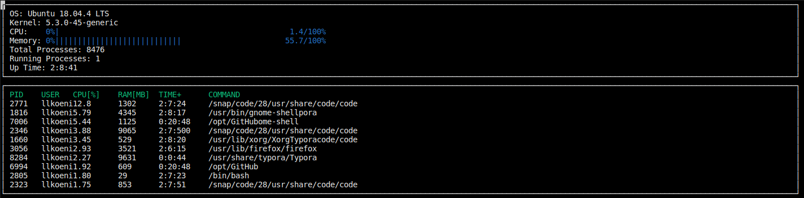

# Project 2 - System Monitor

This is the second project from [Udacity's C++ Nanodegree Program](https://www.udacity.com/course/c-plus-plus-nanodegree--nd213). It covers object-orientated programming in the coding language C++, reading from files and formatting strings.

----

## Project Overview

### Goals:

* Use object-orientated programming to build a system monitor for Linux like htop.
* Bonus: Instead of aggregated data for the CPU usage, get more accurate, real-time data.

### Structure:

The project is divided into different files. All header files can be found in the `include` folder.

* `src/main.cpp`: Calls the system and ncurses logic.
* `src/format.cpp` (and header file): Functions for string formatting (time format).
* `src/ncurses_display.cpp` (and header file): Functionality for displaying results in the terminal
* `src/linux_parser.cpp` (and header file): Functions to read data from the file system of Linux
* `src/system.cpp` (and header file): Class for system data and logic
* `src/process.cpp` (and header file): Class for process data and logic
* `src/processor.cpp` (and header file): Class for processor data and logic
* other helper, build and installation files

### Dependencies

This project needs following dependencies:

* Linux based OS with Linux >= 2.6
* cmake >= 3.11.3
* make >= 4.1 (Linux)
* gcc/g++ >= 7.4.0
* ncurses
  * [ncurses](https://www.gnu.org/software/ncurses/) is a library that facilitates text-based graphical output in the terminal.
  * Use `sudo apt install libncurses5-dev libncursesw5-dev` to install ncurses

### Basic Build and Run Instructions

1. Clone this repository.
2. Install dependencies.
3. Build and compile: `build all`
4. Run it: `./build/monitor` 

----

# Results

Here you can see an example result (from my Linux laptop):

